# FUENTE 1: ARQUITECTURA Y SRE DE FLOYDIA SUITE 2.0
**Ecosistema FloydIA — Centro Unificado de Comando, SRE y Telemetría IA**
*Fecha de Consolidación: 2026-08-31 | Versión: 2.0.4 | Protocolo v27*

---

## 1. Visión General y Topología de Infraestructura
FloydIA Suite 2.0 es el panel de control integral desarrollado en PyQt6 (Python 3.11+) para el gobierno operativo, monitoreo de salud del sistema, gestión de agentes inteligentes, optimización de recursos locales y administración de claves API distribuidas.

### Topología del Ecosistema:
1. **HP15 Local (Laptop Arch SSOT - UID 1000 `tec`)**:
   - Entorno principal de desarrollo, interfaz gráfica PyQt6, editores de código (Zed, Antigravity IDE, Cursor/OpenCode).
   - Memoria Swap optimizada con `zram+zstd` (8GB), cgroups v2 y perfiles térmicos/energéticos (`power-profiles-daemon`).
2. **Proxmox CT114 (`ubuntu-hybrid` - `192.168.1.238`)**:
   - Servidor híbrido consolidado para cargas pesadas.
   - Endpoint Playwright Remoto: `ws://192.168.1.238:3000/playwright` (0% consumo de RAM local en HP15 durante QA y web scraping).
   - FlareSolverr en puerto `:8191` para resolución determinista de Cloudflare / Turnstile.
   - Transcodificación acelerada Intel QSV (FFmpeg / Tdarr / Jackett).
3. **Proxmox CT106 (`obsidian-vault` - `192.168.1.232`)**:
   - Servidor central de almacenamiento y base de conocimiento Obsidian.
   - Sincronización bidireccional en tiempo real con `memory-bank/` mediante Syncthing.
4. **MikroTik RouterOS 7.x (`192.168.1.1` - Hex S)**:
   - Enrutamiento troncal, FastTrack activado, aislamiento de VLANs IoT, protección anti MAC-Drift mediante `admin-mac` fijo y firewall perimetral con filtrado DNS por DoH.

```mermaid
graph TD
    subgraph HP15_Local["💻 HP15 Arch Linux (SSOT)"]
        FS[⚡ FloydIA Suite 2.0]
        AGY[🛸 Antigravity IDE]
        OC[👾 OpenCode CLI / GUI]
        HM[🪽 Hermes Agent]
        ENV[🔐 .env / SOPS Age]
        MB[🧠 Memory Bank Local]
    end

    subgraph Proxmox_CT114["🟢 CT114 (ubuntu-hybrid: 192.168.1.238)"]
        PW[🎭 Playwright Headless WS :3000]
        FSOLV[🛡️ FlareSolverr :8191]
        TDARR[🎬 Tdarr / FFmpeg QSV]
    end

    subgraph Proxmox_CT106["🟢 CT106 (Vault Obsidian: 192.168.1.232)"]
        OBS[📚 Obsidian Core Vault]
        SYNC[🔄 Syncthing Daemon]
    end

    subgraph Red_Mikrotik["🛡️ MikroTik RouterOS 7.x (192.168.1.1)"]
        MT[Hex S FastTrack & Bridge Admin-MAC]
    end

    FS -->|Propagación 1-Clic| OC
    FS -->|Propagación 1-Clic| HM
    FS -->|Telemetría & Sondeo| ENV
    MB <-->|Syncthing Bidireccional| SYNC
    FS -->|QA E5 Remoto| PW
    FS -->|Diagnóstico Ping/Socket| MT
    FS -->|Diagnóstico SSH| Proxmox_CT114
```

---

## 2. Arquitectura de Módulos de FloydIA Suite 2.0

La aplicación principal (`floydia_suite_app.py`) implementa una arquitectura modular desacoplada mediante un contenedor `QStackedWidget` con **Lazy Loading** de pestañas y subprocesos asíncronos (`CancellableThread` / `QThread`) para evitar bloqueos del hilo principal (GUI thread).

### Estructura de Módulos (`FLOYDIA_SUITE_2.0/modules/`):

| Módulo | Clase Principal | Responsabilidad y Flujo Operativo |
| :--- | :--- | :--- |
| `tab_reboot.py` | `TabReboot` | Orquestación de reinicio y salud de nodos (HP15, CT114, CT106, MikroTik). Sondeos TCP/ICMP no bloqueantes, ejecución remota segura y fallback de emergencia. |
| `tab_optimizer.py` | `TabOptimizer` | Monitor de memoria física/swap (ZRAM), asesino preventivo de procesos zombies/huérfanos (Chrome, Playwright, Python hangs), compactación del Memory Bank y optimización de I/O. |
| `tab_mcp_skills.py` | `TabMcpSkills` | Gestor del catálogo de MCPs (Model Context Protocol) y Skills agénticas. Activación/desactivación por perfiles (Coding, Research, SRE, Design). |
| `tab_radar.py` | `TabRadar` | Observatorio en vivo de modelos LLM (Google AI Studio, NVIDIA NIM, DeepSeek, OpenRouter, Mistral, Ollama). Sondeo de latencia (TTFT), micro-benchmarks y Asesor IA. |
| `tab_api_manager.py` | `TabApiManager` | Administración centralizada multi-cuenta [C1..C8] de claves API y endpoints. Propagación atómica 1-clic a OpenCode, Hermes, Zed y réplica remota HP45. |
| `tab_diagnostics.py` | `TabDiagnostics` | SRE Probe de conectividad LAN/WAN, latencia hacia Cloudflare/Google DNS, chequeo de sockets y registro estructurado de fallos. |
| `theme.py` | — | Sistema de diseño FLOYDIA V6 (Dark Luxury Neon: fondo `#070D14`, acento cian `#00F5D4`, azul eléctrico `#00BBF9`, tipografía Inter y estilos QSS modernos). |

---

## 3. Flujo de Datos, Configuración y Estado

1. **Persistencia Atómica (`atomic_json_write`)**:
   - Todo guardado de configuración en disco (`cache/custom_apis.json`, `cache/last_radar_telemetry.json`, `~/.config/opencode/opencode.jsonc`, `~/.hermes/config.yaml`) utiliza bloqueo de archivos con `fcntl.flock(LOCK_EX)` y reemplazo atómico vía archivo temporal (`os.replace`) para garantizar tolerancia a caídas sin corrupción de datos.
2. **Sanitización P0 de Credenciales**:
   - Ninguna clave API real se serializa en archivos de caché JSON ni en reportes exportados (`sanitize_for_persistence`, `sanitize_api_for_disk`).
   - Las claves se inyectan en tiempo de ejecución desde el SSOT `/home/tec/.secrets/antigravity.env` (enlazado simbólicamente como `.env`).
3. **Mapeo Multi-Cuenta Canónico [C1..C8]**:
   - Permite alternar y balancear cuotas entre múltiples identidades (Google AI Studio C1..C6, NVIDIA NIM C1/C2/C7, DeepSeek Direct C1/C7, OpenRouter C1/C7).
