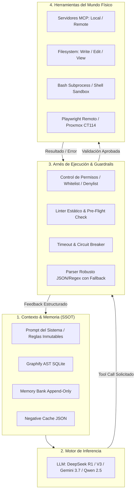

# FUENTE 2: HARNESS ENGINEERING Y FRAMEWORKS AGÉNTICOS
**Sintaxis, Schemas de Configuración y Ciclo de Vida en el Ecosistema FloydIA**
*Fecha de Consolidación: 2026-08-31 | Versión: 2.0.4 | Protocolo v27*

---

## 1. Fundamentos de Harness Engineering

Un **Harness Agéntico** (Arnés de Ingeniería para Modelos de Lenguaje) es una capa de mediación de software determinista que desacopla la inteligencia pura del LLM de su entorno de ejecución física. Su objetivo es transformar un modelo probabilístico en un sistema de producción confiable, reproducible y seguro.



### Componentes de un Harness Profesional:
1. **Desacoplamiento Contexto / Herramientas**: El LLM solo recibe el schema mínimo de las herramientas que necesita para el sub-paso actual (evitando token bloat).
2. **Puerta de Memoria y Pre-Flight Check**: Verificación determinista antes de emitir llamadas de modificación en disco o red.
3. **Manejo de Respuestas Estructuradas con Tolerancia a Fallos**: Si el modelo emite Markdown dentro de un bloque JSON o caracteres de escape no estándar, el arnés ejecuta normalizadores antes de que el parseo falle.
4. **Bucle de Evaluación Determinado**: Toda afirmación de éxito debe estar respaldada por aserciones de código o verificaciones criptográficas/visuales.

---

## 2. Comparativa de Schemas y Sintaxis de Configuración

### A. OpenCode (`~/.config/opencode/opencode.jsonc`)
OpenCode utiliza un archivo de configuración en formato JSON con comentarios (`jsonc`) basado en el AI SDK de Vercel.

```jsonc
{
  "$schema": "https://opencode.ai/config.json",
  "model": "google/gemini-3.7-flash",
  "small_model": "openrouter/nvidia/nemotron-3-nano-omni-30b-a3b-reasoning:free",
  "provider": {
    "deepseek": {
      "npm": "@ai-sdk/openai",
      "name": "DeepSeek Direct [Paid]",
      "options": {
        "baseURL": "https://api.deepseek.com/v1",
        "apiKey": "{env:DEEPSEEK_API_KEY}"
      },
      "models": {
        "deepseek-chat": {
          "name": "DeepSeek Chat V3 (General)"
        },
        "deepseek-reasoner": {
          "name": "DeepSeek Reasoner R1 (Thinking)"
        }
      }
    },
    "openrouter": {
      "npm": "@ai-sdk/openai",
      "name": "OpenRouter Global Hub [C7]",
      "options": {
        "baseURL": "https://openrouter.ai/api/v1",
        "apiKey": "{env:C7_OPENROUTER_OPENCODE_HP15}"
      },
      "models": {
        "openrouter/auto": { "name": "OpenRouter Auto" },
        "deepseek/deepseek-r1:free": { "name": "DeepSeek R1 (Free)" },
        "qwen/qwen-2.5-coder-32b-instruct:free": { "name": "Qwen 2.5 Coder (Free)" }
      }
    }
  },
  "mcp": {
    "memory_bank": {
      "command": "python3",
      "args": ["/home/tec/Dropbox/ANTIGRAVITY_PROJECTS/SCRIPTS/mcp_memory_server.py"]
    }
  }
}
```

### B. Hermes Agent (`~/.hermes/config.yaml`)
Hermes CLI requiere un archivo YAML estricto con declaración de proveedores, modelos de fallback, directivas de base de datos SQLite WAL y límites del sistema operativo.

```yaml
model:
  default: gemini-3.7-flash
  provider: google
  base_url: https://generativelanguage.googleapis.com/v1beta/openai/

fallback_model:
  provider: openrouter
  model: minimax/minimax-m3:free

providers:
  google:
    name: "Google AI Studio Pro [C1]"
    env_key: C1_GOOGLE_AISTUDIO
    base_url: https://generativelanguage.googleapis.com/v1beta/openai
    api: openai-completions
    models:
      - gemini-3.7-flash
      - gemini-3.6-flash
      - gemma-4-31b-it

  deepseek_direct:
    name: "DeepSeek Direct [Paid]"
    env_key: DEEPSEEK_API_KEY
    base_url: https://api.deepseek.com/v1
    api: openai-completions
    models:
      - deepseek-chat
      - deepseek-reasoner

  nvidia_c7:
    name: "NVIDIA NIM Dedicated [C7]"
    env_key: C7_NVIDIA
    base_url: https://integrate.api.nvidia.com/v1
    api: openai-completions
    models:
      - nvidia/nemotron-3-nano-omni-30b-a3b-reasoning
      - deepseek-ai/deepseek-v4-flash-0731

database:
  journal_mode: wal

runtime:
  nofile_soft_limit: 4096

_config_version: 40
```

### C. DeepSeek Harness Nativo (Python SDK / REST Async)
Implementación canónica en Python para invocar DeepSeek R1/V3 con streaming, manejo de tokens de pensamiento (`reasoning_content`) y circuit breaker:

```python
import os
import json
import httpx
from typing import AsyncGenerator, Dict, Any, Optional

class DeepSeekHarness:
    def __init__(self, api_key: Optional[str] = None, base_url: str = "https://api.deepseek.com/v1"):
        self.api_key = api_key or os.getenv("DEEPSEEK_API_KEY")
        if not self.api_key:
            raise ValueError("DEEPSEEK_API_KEY no encontrada en entorno ni configuración.")
        self.base_url = base_url.rstrip("/")
        self.headers = {
            "Authorization": f"Bearer {self.api_key}",
            "Content-Type": "application/json"
        }

    async def execute_reasoning_stream(
        self,
        prompt: str,
        system_prompt: str = "Eres un Arquitecto de Software experto. Piensa paso a paso.",
        temperature: float = 0.6
    ) -> AsyncGenerator[Dict[str, str], None]:
        url = f"{self.base_url}/chat/completions"
        payload = {
            "model": "deepseek-reasoner",
            "messages": [
                {"role": "system", "content": system_prompt},
                {"role": "user", "content": prompt}
            ],
            "temperature": temperature,
            "stream": True
        }

        async with httpx.AsyncClient(timeout=120.0) as client:
            async with client.stream("POST", url, headers=self.headers, json=payload) as response:
                if response.status_code != 200:
                    err_body = await response.aread()
                    yield {"type": "error", "content": f"HTTP {response.status_code}: {err_body.decode('utf-8')}"}
                    return

                async for line in response.aiter_lines():
                    if not line or not line.startswith("data: "):
                        continue
                    data_str = line[6:].strip()
                    if data_str == "[DONE]":
                        break
                    try:
                        chunk = json.loads(data_str)
                        delta = chunk["choices"][0].get("delta", {})
                        
                        # Extraer tokens de razonamiento interno (R1)
                        if "reasoning_content" in delta and delta["reasoning_content"]:
                            yield {"type": "reasoning", "content": delta["reasoning_content"]}
                        # Extraer contenido de respuesta final
                        if "content" in delta and delta["content"]:
                            yield {"type": "answer", "content": delta["content"]}
                    except json.JSONDecodeError:
                        continue
```
