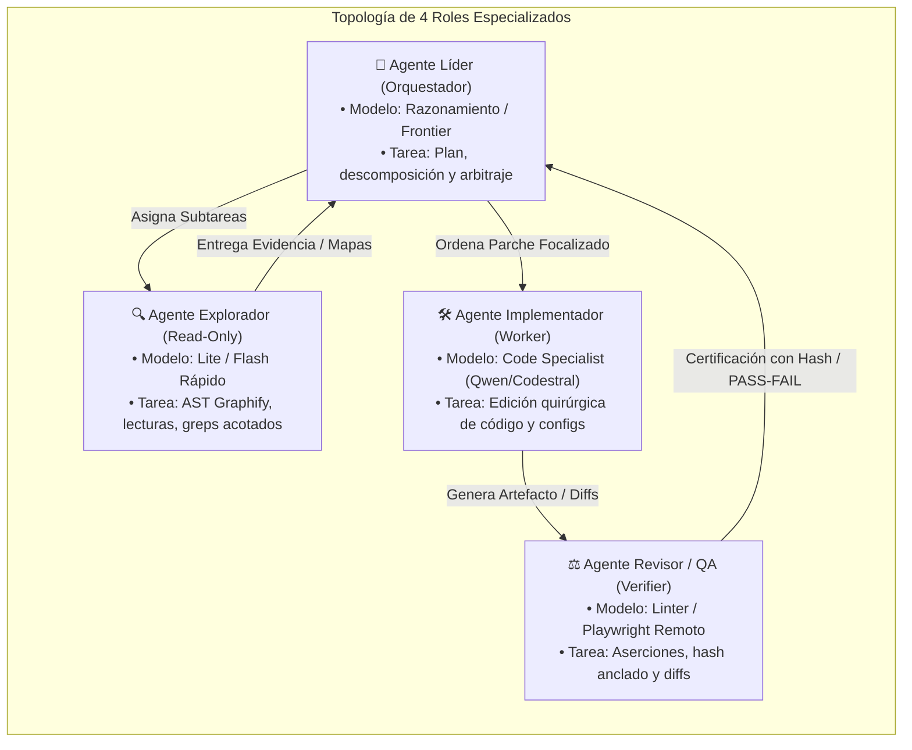

# FUENTE 3: ORQUESTACIÓN MULTI-AGENTE LOCAL EN PC
**Topología de Roles, Pipelines Paralelos, IPC y Gestión SRE de Recursos**
*Fecha de Consolidación: 2026-08-31 | Versión: 2.0.4 | Protocolo v27*

---

## 1. Desacoplamiento de Roles en Sistemas Multi-Agente

Para ejecutar múltiples agentes inteligentes de manera eficiente en una única estación de trabajo (ej. Laptop HP15 Arch Linux, 16GB RAM, i5/i7) sin colapsar el sistema ni agotar las cuotas de tokens, es obligatorio implementar la **Metodología de Roles Desacoplados**:



### Especificación de Roles:

1. **Agente Líder (Orquestador)**:
   - *Tier de Modelo*: `razonamiento` (`deepseek-reasoner`, `gemini-2.5-pro`, `claude-opus-thinking`).
   - *Herramientas permitidas*: Planificación, lectura de resúmenes de contexto, invocación de sub-agentes y síntesis final.
   - *Prohibición*: PROHIBIDO realizar escrituras directas masivas en código sin previa exploración.
2. **Agente Explorador (Investigador)**:
   - *Tier de Modelo*: `flash/lite` (`gemini-2.0-flash`, `qoder/lite`, `qwen-2.5-coder-7b`).
   - *Herramientas permitidas*: `graphify query`, `view_file`, `grep_search` acotado, `list_dir`. Modo estrictamente Read-Only.
   - *Objetivo*: Localizar líneas exactas, clases y dependencias AST en <10ms sin quemar tokens del modelo principal.
3. **Agente Implementador (Constructor)**:
   - *Tier de Modelo*: `medio/frontier` (`codestral-latest`, `deepseek-chat`, `qwen-2.5-coder-32b`).
   - *Herramientas permitidas*: `replace_file_content`, `multi_replace_file_content`, `write_to_file`.
   - *Regla de Oro*: Edición quirúrgica basada estrictamente en los números de línea reportados por el Explorador.
4. **Agente Revisor / SRE (Certificador)**:
   - *Tier de Modelo*: Motor determinista (Linters, Node.js scripts, Playwright en CT114).
   - *Aserción*: Valida que los cambios no introduzcan regresiones, sintaxis inválida ni desbordamientos visuales. Emite el hash SHA256 anclado del resultado.

---

## 2. Gestión de Recursos Locales (SRE Governor HP15)

Ejecutar agentes locales simultáneos requiere evitar contención de memoria física, thrashing de I/O y bloqueo de la interfaz gráfica:

### Directivas de Hardware y Rendimiento:
1. **Delegación Remota a CT114 (0% RAM local)**:
   - Toda ejecución de navegadores headless (Playwright / Puppeteer / FlareSolverr) debe conectarse a través del websocket `ws://192.168.1.238:3000/playwright`. Esto ahorra entre 1.5 GB y 3.0 GB de memoria en la laptop local.
2. **Memoria Swap ZRAM con compresión Zstandard (`zstd`)**:
   - Asignación de 8GB ZRAM sobre RAM física para comprimir páginas inactivas con latencia inferior a 5 microsegundos.
3. **Control de Concurrencia de Subprocesos (`ThreadPoolExecutor` acotado)**:
   - En Python/PyQt6, las tareas paralelas de red (ej. sondeos de latencia en `TabRadar` o `TabApiManager`) se ejecutan con `max_workers=min(12, os.cpu_count() * 2)` y timeouts duros de 7 a 15 segundos.
4. **Mecanismo Anti-Hang y Asesinato Preventivo**:
   - `TabOptimizer` escanea cada 60 segundos la tabla de procesos del sistema operativo. Si detecta instancias huérfanas de `chrome`, `node` o procesos Python en estado zombie consumiendo CPU >90% por más de 3 minutos, emite señales `SIGTERM` seguidas de `SIGKILL` determinista.

---

## 3. Protocolos de Comunicación Inter-Procesos (IPC)

Para la sincronización entre FloydIA Suite (PyQt6 GUI), Antigravity IDE, Hermes CLI y OpenCode:

```
[PyQt6 GUI / FloydIA Suite] ──(atomic_json_write)──> [cache/*.json & configs]
                                                               │
[Antigravity IDE / AGY]     <──(frecuencia / polling / fs)─────┘
                                                               │
[Hermes CLI / SQLite WAL]   <──(config.yaml & provider cache)──┘
```

1. **Bloqueo Exclusivo de Archivos (`fcntl.flock`)**:
   - Todo archivo compartido entre herramientas de escritorio e instancias de terminal se abre con `LOCK_EX` durante la escritura y se cierra inmediatamente después del flush de I/O.
2. **Base de Datos SQLite en Modo WAL (`PRAGMA journal_mode=WAL`)**:
   - Utilizado en Hermes y Graphify AST para permitir múltiples lectores concurrentes mientras un solo escritor actualiza el grafo relacional sin bloqueos de tabla.
